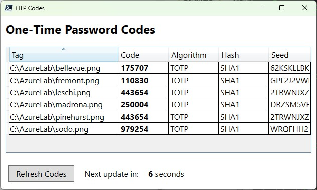

# The OTP PowerShell module

```powershell
Find-Module -Name 'OTP' 
Install-Module -Name 'OTP' # -Scope CurrentUser	
Get-Command -Module 'OTP'
Get-Alias -Name '*OTP*' 
```

The OTP module provides [HOTP (RFC 4226)](https://www.ietf.org/rfc/rfc4226.txt) and [TOTP (RFC 6238)](https://www.ietf.org/rfc/rfc6328.txt)  functionality for [MFA/2FA](https://en.wikipedia.org/wiki/Multi-factor_authentication). The module itself is written in PowerShell, using the [Otp.NET.dll](https://www.nuget.org/packages/Otp.NET) and [ZXing.dll](https://github.com/micjahn/ZXing.Net/releases) libraries. 

Cmdlets and aliases: 
- Get-OTPCode (gotp)
- New-OTPSecret (notp)
- Read-OTPQRCode (rotp)

The module is primarily intended for demonstration purposes, showcasing key PowerShell concepts such as user-friendliness, pipelining, autocompletion, and array processing. However, it is also fully functional in terms of multi-factor authentication with OTP. Or at least it should be.

## Basic usage

```powershell
## Create a new TOTP secrets with a random seed
New-OTPSecret -Label 'foo:bar'  

## Create secret, save QRCode, get TOTP code
New-OTPSecret -Label 'foo:bar' -SaveQRCode $env:temp\foobar.png 
Read-OTPQRCode -Path $env:temp\foobar.png | Get-OTPCode

## Create a new secret from a given seed
$mySecret = New-OTPSecret -Seed 'MBT4SFXK3IZB23FO' -Label 'foo:bar' -Issuer 'Contoso' -Tag 'Redmond'
$mySecret | Get-OTPCode | Select-Object -ExpandProperty 'Code'  | Set-Clipboard
```

## Intended usecase


You can create your own seed and QRCode, but it's more likely that you will be presented with a QRCode on a website, just as with GitHub. The QRCode that is displayed to you represents/encodes a so-called **OTP auth URI**:
<pre style="background-color:#edf5fa">
otpauth://totp/GitHub:thorstenbutz?secret=<b>RXYDZZYTKUWKLNSX</b>&issuer=GitHub
</pre>

<!-- 
<pre>otpauth://TYPE/LABEL?PARAMETERS</pre>
-->

The noteworthy part is located behind the "secret" parameter. **RXYDZZYTKUWKLNSX** is actually nothing more than a randomly generated shared secret created by the service provider (in this case, GitHub). This secret is also known as a "seed".

The desired OTP code can also be calculated using a bitmap of the QR code and the alphanumeric string.

```powershell
## OTP code from bitmap
Read-OTPQRCode -Path '.\media\github_demo.png'  | Get-OTPCode

## OTP code from seed
New-OTPSecret -Seed 'RXYDZZYTKUWKLNSX' | Get-OTPCode

## Output (Example)
Code   Algorithm HashAlgorithm Seed
----   --------- ------------- ----
832620 TOTP      SHA1          RXYDZZYTKUWKLNSX
832620 TOTP      SHA1          RXYDZZYTKUWKLNSX
```

## Lab environments

Consider lab or testing environments where you might have several test accounts that require MFA authentication. 

Rather than having lab users or students repeatedly reconfigure a second factor on their smartphones, the OTP module provides a simple solution. You can also scan any number of QR codes or alphanumeric seeds and have the OTP codes displayed in a GUI that updates automatically ‒ with a single line of code.

```powershell
Get-ChildItem -Path 'C:\AzureLab\*.png' | Read-OTPQRCode | Get-OTPCode -IncludePath -ShowUI
```


## Further reading

- [OTP guide](OTP/0.1.1/docs/OTP-Guide.md)
- [The background story](backstory/backstory.md)
