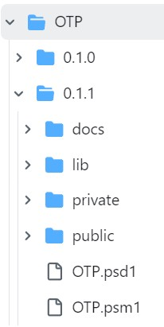

# The backstory

```powershell
    Find-Module -Tag 'VibeCoding'
    Find-Module -Tag 'EducatedPrompting'    
```



You may have heard the term ["Vibe coding"](https://en.wikipedia.org/wiki/Vibe_coding). Every line of code in this module was published on the PowerShell Gallery. It was generated by AI. I did not write a single character of code in the traditional sense. The same applies to everything in the "OTP" folder in this repository (see the picture on the right-hand side).

Initially, I was looking for the simplest possible way to generate a number of OTP codes in a lab environment. Consider test installations, training courses or workshops, for example. Since Microsoft raised the authentication requirements for Entra ID accounts, it can take quite a long time to activate test accounts and make them usable.

I came across several OTP modules that didn't quite meet my requirements. So it seemed obvious that I should write my own. Since implementing the OTP protocol is straightforward, I started with an AI-generated snippet on a whim.

I generated the basic source code in just a couple of minutes, and the quality of these initial results really blew me away. I didn't expect them to be of such a high standard. Agent mode in Cursor, along with Claude Sonnet's AI models, delivered an impressive standard in Q2 of 2025. 

The first version of the module was created with the help of three core components:

1. The editor Cursor, a fork of VSCode ([https://cursor.com/](https://cursor.com/))
2. Anthropics AI model "Claude Sonnet", versions 3.5 and 4 ([https://www.anthropic.com/](https://www.anthropic.com/))
3. Educated prompting
 
It soon became apparent that the results were so convincing that I kept expanding the module's range of functions. Take the generation of a WPF-based interface as an example. Manually, I would most likely not have bothered to write this code. With each expansion, my amazement grew, but it also became clear that the agent was finding it increasingly difficult to grasp the context of the application. Complexity seems (seemed) to be the biggest problem for AI. 

## Let's talk about "educated prompting" 

So can anyone create such a module without specific knowledge?
I don't think so.

A significant part of the work consists of creating sets of rules that are specified for the agents. Furthermore, one must read and understand the (often faulty) code and, if necessary, identify errors so that they can be corrected in a targeted manner. This is a very laborious undertaking once the number of lines of code exceeds a certain threshold.

In the introductory [Readme.md](../Readme.md), I describe the purpose of the module with these words:

> The module is primarily intended for demonstration purposes, showcasing key PowerShell concepts such as user-friendliness, pipelining, autocompletion, and array processing.

Essentially, artificial intelligence works with statistical data using a multitude of human-generated examples. In doing so, it also imitates bad habits, questionable implementations, and shortcomings. Eliminating this undesirable code is surprisingly time-consuming.

For these reasons, I really like the term "educated prompting" (which I invented?). Based on the well-known phrase "educated guessing", it makes it clear that, although working with an AI-supported editor makes things much easier thanks to features such as syntax highlighting, auto-completion and IntelliSense, it is not an effortless, self-running process. To illustrate this, I will document the underlying rules (see the code box below). These rules are stored in the editor and must be taken into account by the agent at all times. However, the combination of Cursor and Claude Sonnet often works poorly and inadequately. This means that, as the "prompter", you have to repeatedly request that code sequences be checked. 

**The OTP project rules**

    All of the following rules apply to PowerShell code:
    Prefer single quotes over double quotes (whenever its possible).
    Do not use abbreviations, always name the parameters if you use Cmdlets and arguments,
    never use positional parameters.
    Avoid the "return" statement if not required. 
    Avoid "Write-Host". 
    Prefer static type accelerator syntax, but use  "New-Object" in favour of  stable code.
    Always use Cmdlets with named parameters, never use positional parameters.
    Put the comment-based help directly abouve the corresponding function statement. 
    Use PascalNotation for anything public, camelCase for anything private. 
    I prefer simple functions for private functions, in case Cmdletbinding and parameter attributes are not required. 
    Parameters should always start with a capital Letter, no matter if public or private. 
    Advanced functions (cmdlets) should provide PipeliningByPropertyname for all parameters where it makes sense.
    Advanced functions (cmdlets) should provide PipeliningByValue for those parameter that matters most, where it makes sense.
    Advanced functions (cmdlets) should also support providing arrays as parameter input, that may be processed with a loop.
    Advanced functions (cmdlets) should utilize the input processing methods (begin,process,end) 
    to also support pipelining and arrays as parameter input.
    Try to keep parameter attribution blocks in a single line.
    Avoid using $TRUE oder $FALSE with parameter parameter attribution blocks,
    avoid declaring default values.
    I require stable .NET libraries of handwritten code. 
    Generally, avoid using the format operator (-f)
    Comments should use 2 hash marks ('##') if they are of an explanatory nature. 
    Never use `$true` assignments in parameter attributes
    In general: KISS (keep it simple and small). 


## Documentation

The module contains a fairly comprehensive [OTP guide](../OTP/0.1.1/docs/OTP-Guide.md), also generated by AI.

In addition, I will have the AI document the errors and bug fixes between releases in the [AIrrors](../AIrrors) folder.


## Past and future of this project

Now that the module has been released, I will maintain it and document its progress. Ideally, the future will show to what extent improvements in newer AI agents will have a positive influence on the improvement and expansion of the code base.

| OTP module version | Agents                | Description                       | Time period     |
| :----------------- | --------------------- | :-------------------------------- | --------------- |
| 0.1.0              | Claude Sonnet 3.5 + 4 | First public release to PSGallery | April-June 2025 |
| 0.1.1              | Claude Sonnet 3.5 + 4 | Bugfix release                    | Sept. 2025      |
|                    |                       |                                   |                 |
