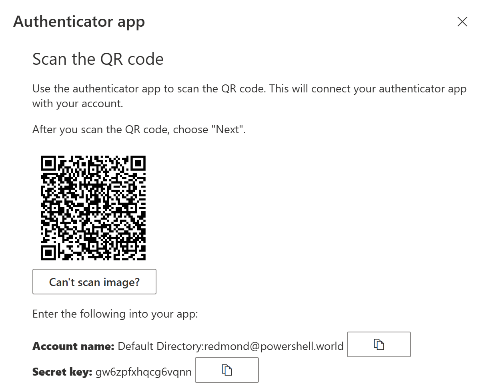

## The Base32 encoded seed

Let's try to understand one of the core principles of the Time-Based One-Time Password (TOTP) algorithm. 

Imagine you set up a second factor for your Microsoft account, as shown in the exhibit.
If you select "Microsoft Authenticator" as your sign-in method, you are actually selecting TOTP authentication. 
This sign-in method is not limited to Microsoft's app — that's just advertising. 
You can use any TOTP application you like. 

### STEP 1

Using TOTP, Microsoft will generate a random sequence of (typically) 80 bits. For example:

    00110101101111011001011110010110111001111000000010001101111010101100000110101101

This number is simply a binary representation of a secret that will be shared between Microsoft (the authenticator or validator) and you (the authenticatee or prover). 
 
The initial secret, also known as the 'seed', never expires. This could be seen as a vulnerability in OTP authentication. If someone captures this underlying seed, they can proceed with the subsequent steps.

### STEP 2

This sequence of bits isn't very user-friendly, is it? 
Since nobody wants to type in such a long sequence of characters, we have to convert it into something more user-friendly. 
That's where Base32 encoding comes in. To avoid typos, we will use a custom alphanumeric string that follows these rules:

- The letters from A to Z, case insensitive 
- The numbers 2,3,4,5,6,7

We intentionally skip a few numbers to avoid confusion (1 vs I, 0 vs O). 

Finally, our custom alphabet consists of 32 different signs, which can be encoded with only 5 bits.

| Char | Binary | Char | Binary | Char | Binary | Char | Binary |
|------|--------|------|--------|------|--------|------|--------|
| A    | 00000  | I    | 01000  | Q    | 10000  | Y    | 11000  |
| B    | 00001  | J    | 01001  | R    | 10001  | Z    | 11001  |
| C    | 00010  | K    | 01010  | S    | 10010  | 2    | 11010  |
| D    | 00011  | L    | 01011  | T    | 10011  | 3    | 11011  |
| E    | 00100  | M    | 01100  | U    | 10100  | 4    | 11100  |
| F    | 00101  | N    | 01101  | V    | 10101  | 5    | 11101  |
| G    | 00110  | O    | 01110  | W    | 10110  | 6    | 11110  |
| H    | 00111  | P    | 01111  | X    | 10111  | 7    | 11111  |

Reference: https://www.rfc-editor.org/rfc/rfc4648#section-6

The example seed, representad in chunks of 5 bits and encoded via Base32:

    00110 10110 11110 11001 01111 00101 10111 00111 10000 00010 00110 11110 10101 10000 01101 01101
    G     W     6     Z     P     F     X     H     Q     C     G     6     V     Q     N     N

### To be continued

The random seed is the non expiring shared secret between the service and the client - the authenticator and the authenticatee. 
After the initial exchange, the seed is hidden underneath the surface. Adding another number, a timestamp for example, both sides can independently calculate a verification code that must be the same. 